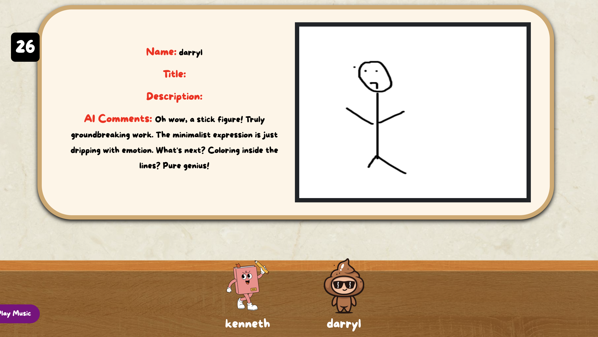

(Host Instructions - meant to use a computer for a better viewing experience)

{: width="50%"}

1. Host clicks on "Host a Game" Button (game music plays immediately. Feel free to mute music)

{: width="50%"}

2. There will be a game code at the top left hand of the screen. Players will join this game via
this code.

3. Minimum of 2 players to start. Maximum of 4 players.
{: width="50%"}
Click on "Start" and the game will play itself with instructions via text/audio.

4. Host screen will show a prompt where players will take this time to draw on their canvas.
After 75 seconds, host screen will tell players to give their drawings a title and description (30 seconds)
{: width="50%"}

5. During voting phase, host screen will show each drawing one by one. Players can all vote for each drawing
(for now, all players can vote their own drawings)
{: width="50%"}

6. At the end of the game. Host presses "End Game" and everyone will leave the game room.
(for now, winner is the first highest votes,including tied votes)
{: width="50%"}

(Player Instructions - meant to use a phone for a better drawing experience)

{: width="50%"}
0. If host has their lobby screen up. Feel free to scan the QR code to be redirected to the website
Please create an account / login afterwards.

1. Player clicks on "Join a Game" Button

{: width="50%"}

2. Enter the game code shown in Host Instructions (step 2)

3. While in the game lobby, just watch the host screen and read/listen to the instructions given
by the host screen

4. Draw on the canvas when instructed to do so
{: width="50%"}

5. Give your image a title and description when instructed to do so
{: width="50%"}

6. Give each drawing your vote from 1 to 10!
{: width="50%"}

7. Game results
{: width="50%"}

