Only host screen not fully mobile responsive. Meant to be viewed on large screen for an audience
Rest of the app is mobile responsive (including player lobby)

(Host Instructions - meant to use a computer for a better viewing experience)

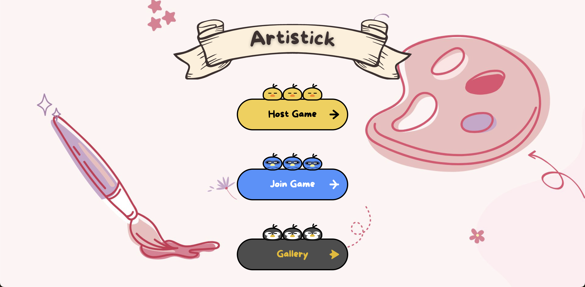

1. Host clicks on "Host a Game" Button (game music plays immediately. Feel free to mute music)

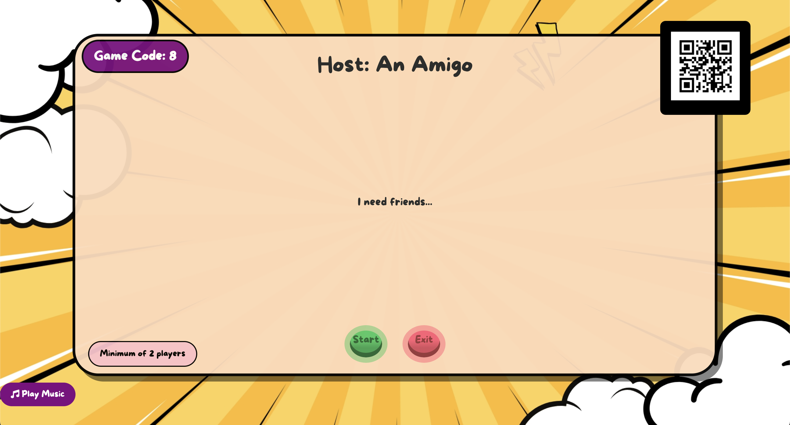

2. There will be a game code at the top left hand of the screen. Players will join this game via
this code.

3. Minimum of 2 players to start. Maximum of 4 players.
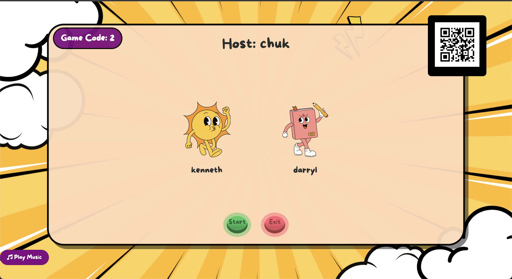
Click on "Start" and the game will play itself with instructions via text/audio.

4. Host screen will show a prompt where players will take this time to draw on their canvas.
After 75 seconds, host screen will tell players to give their drawings a title and description (30 seconds)
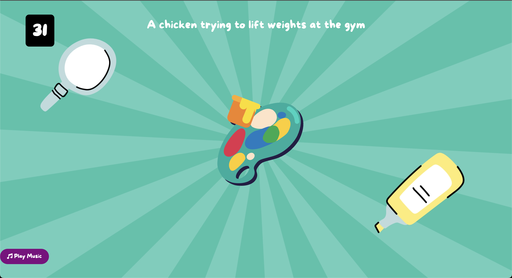

5. During voting phase, host screen will show each drawing one by one. Players can all vote for each drawing
(for now, all players can vote their own drawings)
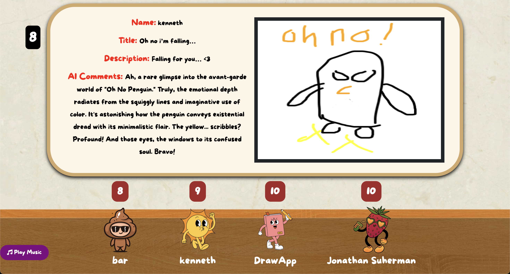

6. At the end of the game. Host presses "End Game" and everyone will leave the game room.
(for now, winner is the first highest votes,including tied votes)
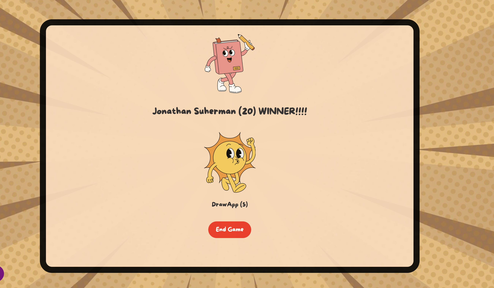

(Player Instructions - meant to use a phone for a better drawing experience)

1. If host has their lobby screen up. Feel free to scan the QR code to be redirected to the website Please create an account / login afterwards.

2. Player clicks on "Join a Game" Button

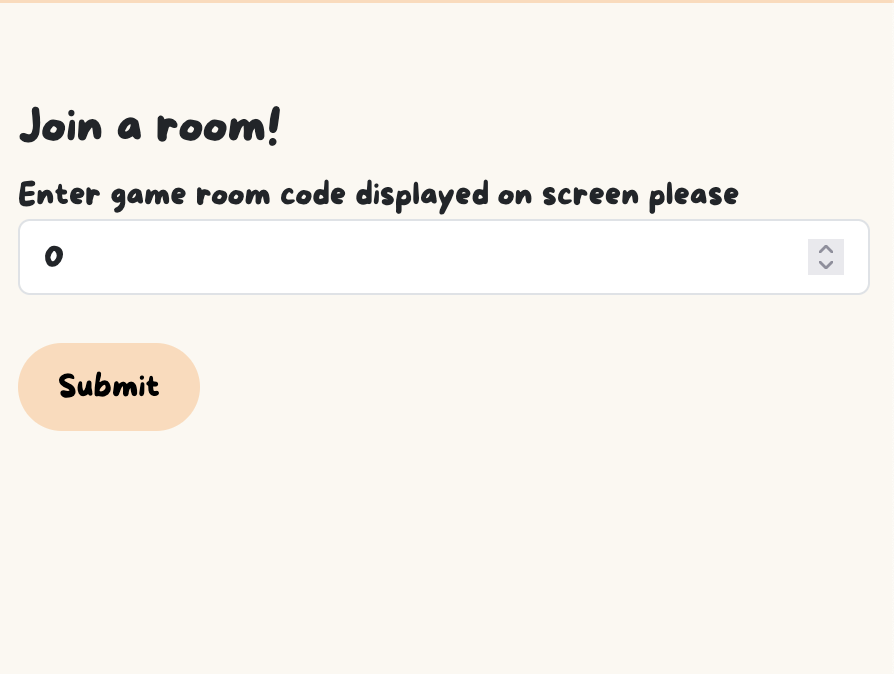

3. Enter the game code shown in Host Instructions (step 2)

4. While in the game lobby, just watch the host screen and read/listen to the instructions given
by the host screen

5. Draw on the canvas when instructed to do so
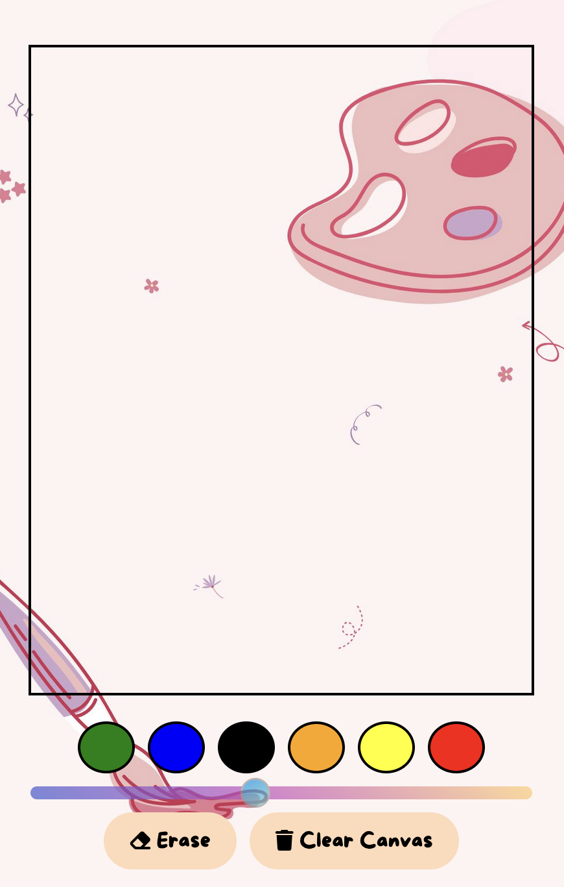

6. Give your image a title and description when instructed to do so
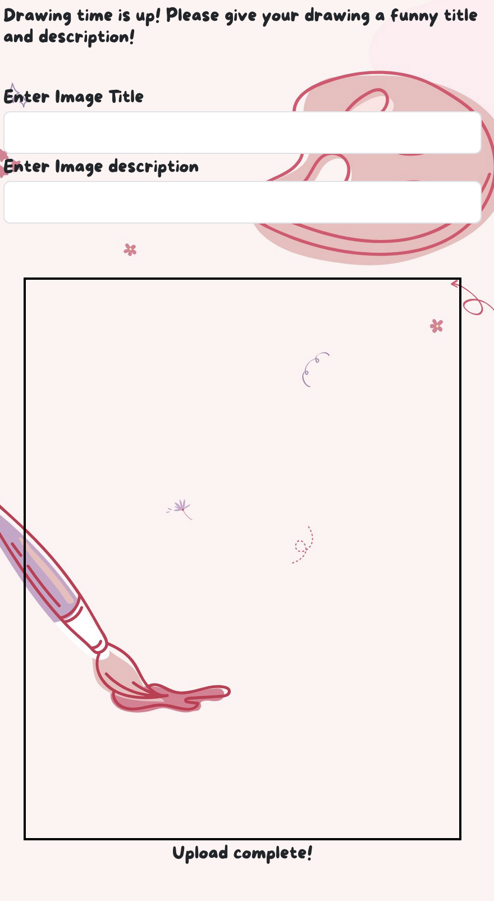

7. Give each drawing your vote from 1 to 10!
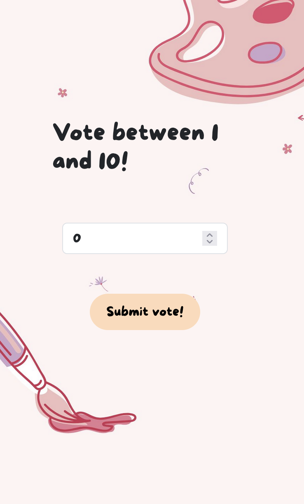

8. Game results
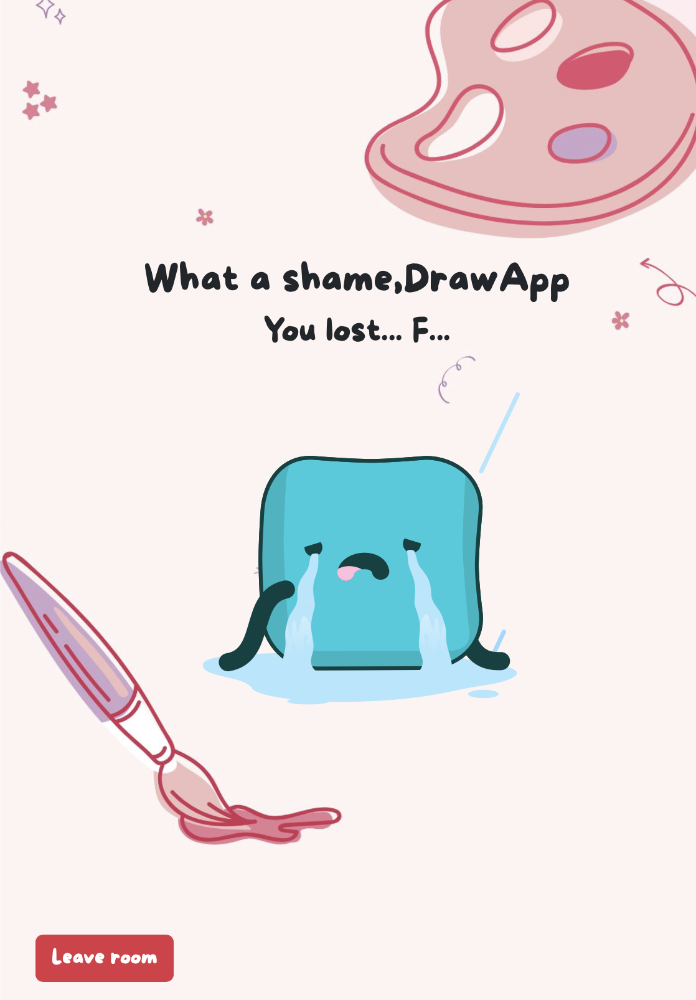

